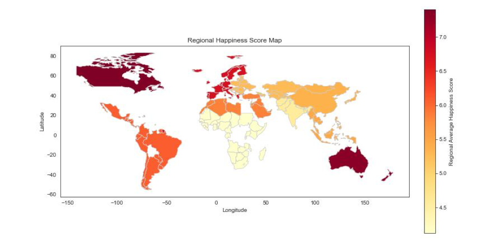
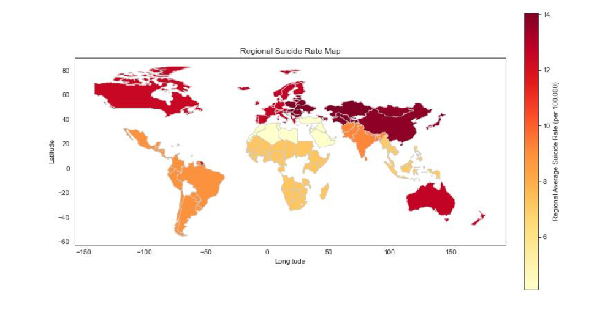
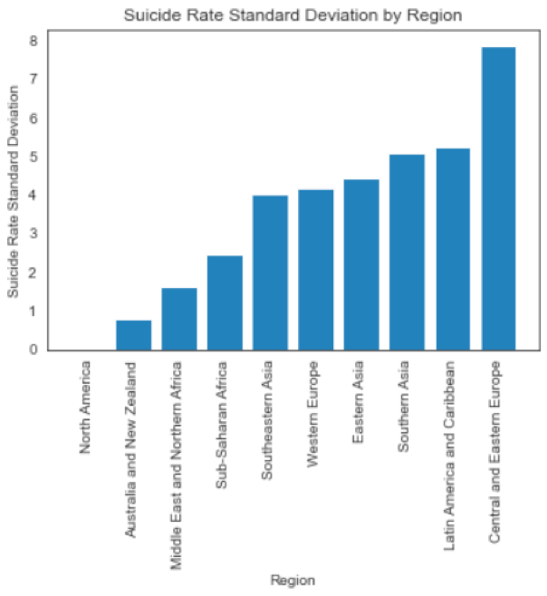

# Analyzing the Relationships Between Happiness Scores, Economic Prosperity, and Suicide Rates

## Introduction
In order to improve mental health outcomes and societal prosperity around the world, it is crucial to understand the factors that contribute to happiness and mental well-being. This project explores the relationships between geographical region, happiness scores as defined by the Gallup World Poll, and suicide rates, with the goal of uncovering trends and patterns that can inform governmental policies for mental well-being improvement and suicide prevention.

The data for this analysis was obtained from three open-access datasets:
1. **World Happiness Report**: Provides happiness scores for countries around the world.
2. **Suicide Rates Overview**: Offers global suicide data compiled by the United Nations, World Bank, and WHO.
3. **World GDP Dataset**: Contains GDP per capita data for various countries.

These datasets, accessed and downloaded on April 19th, 2023, provide information on happiness scores, suicide and disease rates, and economic indicators across 10 different global regions. By combining these datasets, this project uncovers correlations and trends that shed light on the complex relationships between regional factors and mental and physical health.

## Results

### Key Findings
1. **Correlation Analysis**:
   - The heatmap revealed significant negative correlations between the probability percentage of death from disease between the ages of 30 and 70 and both GDP per capita and Happiness Score, with correlation coefficients of -0.67 and -0.65, respectively.
   - A strong positive correlation was observed between Happiness Score and GDP per capita, with a correlation coefficient of 0.71, indicating that countries with higher GDP tend to have higher happiness scores.
   - The correlation between suicide rate and happiness score was found to be 0.28, suggesting a slight positive correlation, though it was not statistically significant.

2. **Geographical Analysis**:
   - The map of regional happiness scores revealed that North America, Australia, and Western Europe exhibit higher average happiness scores compared to neighboring regions, while Sub-Saharan Africa and Southern Asia display lower happiness scores.
   - The map of average regional suicide rates showed that Central and Eastern Europe, Eastern Asia, Western Europe, Australia, and North America have relatively higher suicide rates. The Middle East and Northern Africa exhibit the lowest suicide rate.

3. **Regional Variability in Suicide Rates**:
   - The bar plot of regional standard deviations in suicide rates uncovered intriguing variations amongst different global regions. Despite the Sub-Saharan African and Middle East & Northern African regions encompassing a substantial number of data points compared to other regions, they exhibit some of the lowest standard deviations in the suicide rate column, suggesting a smaller amount of variation in suicide rates among individual countries within these regions.

## Visualizations

### Regional Happiness Score Map

### Regional Suicide Rate Map

### Standard Deviation of Suicide Rates Across Regions

## Discussion

1. **Correlation Analysis**:
   - The negative correlations between the probability of death by disease, GDP per capita, and happiness score suggest that countries with higher disease-related mortality tend to have lower GDP per capita and lower happiness scores. This finding highlights the need for public health interventions that address both mental and physical health.

2. **Complex Nature of Suicide Rates**:
   - The positive correlation between happiness scores and suicide rates raises interesting questions about the mental health crisis. Countries with higher happiness scores might also experience higher expectations and social pressure, which could contribute to increased suicide rates. This finding suggests the need for multifaceted strategies for suicide prevention that address comprehensive societal and cultural factors contributing to mental health.

3. **Regional Analysis**:
   - The maps depicting average happiness scores and suicide rates reveal that regions with higher happiness scores do not necessarily correspond to lower suicide rates, indicating that there are other factors influencing mental health. Additionally, the lower standard deviations in Sub-Saharan Africa, Northern Africa, and the Middle East suggest relatively small variability in suicide rates across countries within these regions.

## Conclusion and Future Directions
Building upon the findings of this analysis, there are several avenues for future research and exploration:
1. **Deeper Analysis of Socio-Cultural Factors**:
   - Investigate the social, structural, and cultural factors within regions with low rates of suicide and variability, such as Sub-Saharan Africa, to identify factors that may be used for suicide prevention.

2. **Longitudinal Studies**:
   - Conduct long-term studies to track shifts in suicide rate, GDP, and happiness scores over time to reveal insights and trends into the dynamic nature of these factors.

3. **Incorporate Additional Variables**:
   - Explore other socioeconomic factors, healthcare access, and mental health services data to better understand the relationships between these variables.

## Repository Structure

- **`README.md`**: Provides an overview of the project, research questions, methodology, and key findings.
- **`correlation_analysis.py`**: Script used to calculate correlation coefficients between variables and generate a heatmap visualization.
- **`data_analysis.py`**: Script used for exploratory data analysis (EDA) of the dataset, including summary statistics and distribution visualizations.
- **`data_cleaning.py`**: Script used to preprocess the datasets, including handling missing values and transforming variables.
- **`data_visualization.py`**: Script used to create the various visualizations, such as maps and bar plots, presented in the report.
- **`requirements.txt`**: Contains a list of the Python packages required to run the scripts and reproduce the analysis.

